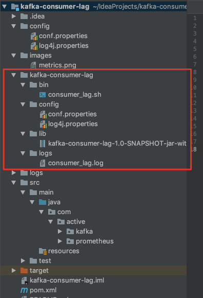
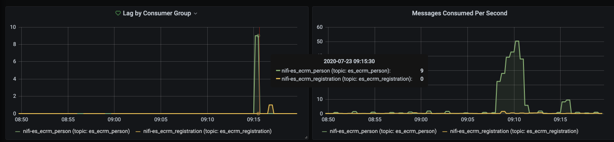

# kafka-consumer-lag
This project is using to export kafka consumer lag metrics to Prometheus. 

## build project
1. Go to project root directory $project_dir  
    mvn package assembly:single
    
2. Copy the kafka-consumer-lag-1.0-SNAPSHOT-jar-with-dependencies.jar to ./kafka-consumer-lag/lib

3. Under $project_dir/kafka-consumer-lag. Start service with below command.
    bin/consumer_lag.sh start
    
4. Check the metrics with http request.
    http://localhost:8089/metrics
    
## deploy project
1. Copy the entire directory kafak-consumer-lag to a directory on your server
2. Start service with command "bin/consumer_lag.sh start"

 
## Kafka consumer lag metrics in Granfana
